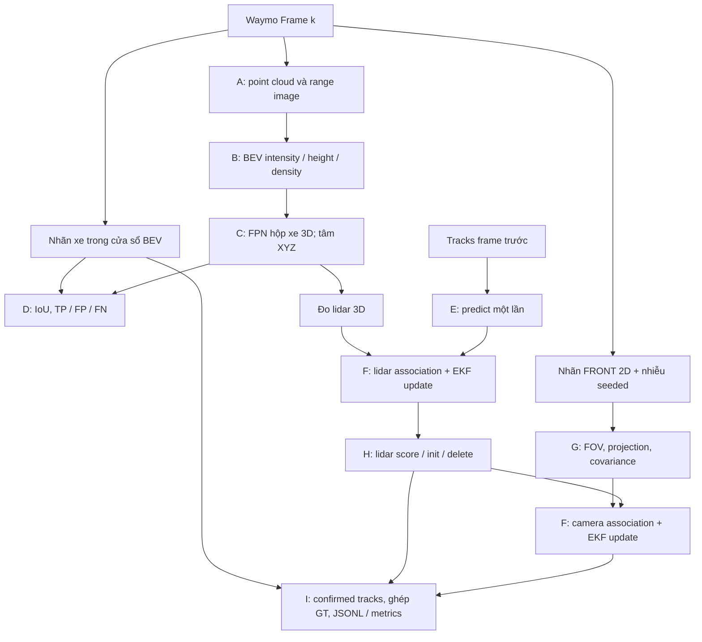
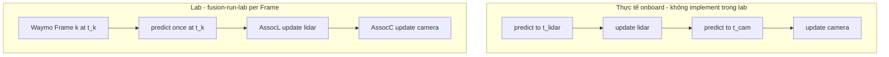

# Lab Day 23 — Sensor Fusion (repo học viên)

Pipeline đầy đủ **Part A → I**: LiDAR → BEV → FPN detection → metrics → EKF → association → **camera fusion** → track management → tích hợp Waymo.

**Part A–D** đã có code sẵn (đọc hiểu). **Bạn implement Part E–H** theo các dòng `# vi: TODO` trong từng file `workspace/`. Runtime Waymo, Jacobian camera `H`, và `fusion-run-lab` do `fusion_lab` (platform) cung cấp.

---

## 1. Mục tiêu học tập

- **Detection vs tracking:** detector tạo *đo lường* từng frame; tracker giữ *danh tính* xe qua thời gian.
- **BEV:** point cloud → lưới 2D (intensity, height, density) → FPN-ResNet (weight có sẵn, không train).
- **EKF 6D:** state `(px, py, pz, vx, vy, vz)`; predict/update; innovation khác nhau giữa lidar 3D và camera 2D (`z`, `R`, `H`).
- **Association:** Mahalanobis + cổng χ², gán greedy gần nhất.
- **Fusion track-level:** lidar cho vị trí 3D; camera bổ sung đo 2D khi trong FOV — **track-then-fuse** (một tracker, nhiều lần cập nhật EKF sau gán từng modality), **không** gộp raw sensor trước detection.

---

## 2. Kiến trúc pipeline & fusion

### 2.0 Detection và tracking trong một frame

Detector đọc BEV và trả các hộp xe độc lập theo từng frame. Tracker nhận tâm hộp
3D làm đo lidar, dự báo trạng thái 6D rồi gán đo để duy trì danh tính qua thời
gian. Hai phần có phép đánh giá riêng: IoU cho detection và sai số vị trí của
track confirmed được ghép một-một với nhãn xe hợp lệ cho tracking.

### 2.1 Sơ đồ data flow

Sơ đồ Mermaid dưới đây mô tả pipeline của lab và được viết riêng cho tài liệu
này. Camera **không chạy detector ảnh**: platform lấy tâm hộp 2D ground-truth
của nhóm `CameraName.FRONT`, thêm nhiễu theo `--seed`, rồi dùng nó làm đo EKF.
Đây là thử nghiệm fusion với đo mô phỏng từ nhãn, không chứng minh chất lượng
một camera detector hoặc một hệ thống perception độc lập với ground truth.

### 2.2 Sơ đồ Part A–I (fusion-run-lab)



| Part | Module | Vai trò | Bạn implement? |
|------|--------|---------|----------------|
| A | `lidar_viz.py` | Range image | Không — đọc code có sẵn |
| B | `bev_mapping.py` | PCL → BEV | Không — đọc code có sẵn |
| C | `detection_pipeline.py` | FPN → hộp 3D | Không — đọc code có sẵn |
| D | `detection_metrics.py` | IoU, P/R | Không — đọc code có sẵn |
| E | `kalman.py` | EKF predict/update | **Có — TODO trong file** |
| F | `association.py` | Gán lidar & camera | **Có — TODO trong file** |
| G | `camera_fusion.py` | FOV, h(x), R | **Có — TODO trong file** |
| H | `track_management.py` | Init, score, delete | **Có — TODO trong file** |
| I | `fusion-run-lab` | Waymo loop | Platform (không sửa) |

### 2.3 Hướng tiếp cận (lộ trình)

1. Đọc **§2.1** + **§2.2** + bảng Part — nắm **track-then-fuse** (*không* phải fuse-then-track): giữ **một** danh sách track, **predict một lần**/frame, rồi lần lượt EKF update theo modality (**AssocL** lidar → **AssocC** camera khi fusion). Khác vòng **predict–update từng sensor async** onboard — xem **§2.4**.
2. **Part A→D** — mở lần lượt `lidar_viz.py` → `bev_mapping.py` → `detection_pipeline.py` → `detection_metrics.py`; **đọc**, không sửa để nộp fusion.
3. **Part E→H** — implement theo phụ thuộc:
   - `kalman.py` (EKF) trước;
   - `camera_fusion.py` (h, FOV, R) song song hoặc trước bước camera trong association;
   - `association.py` (Mahalanobis, **AssocL** / **AssocC**);
   - `track_management.py` (init, score, delete).
4. **Part I** — `fusion-run-lab --fusion compare`, log + `metrics.json`, điền `SUBMISSION.md`.

### Một frame Waymo (thứ tự trong `fusion-run-lab`)

| Bước | Việc làm |
|------|----------|
| 1 | PCL → BEV → detection lidar |
| 2 | (Tuỳ chọn) metrics detection vs labels |
| 3 | Tạo **đo lidar** từ detection |
| 4 | **EKF predict** mọi track (một lần, trước gán) |
| 5 | **AssocL:** gán lidar → EKF update → track management (`manage_tracks`) |
| 6 | (Fusion) Đo FRONT 2D có nhiễu → **AssocC:** gán camera → EKF update; không đổi lifecycle |

**Chế độ `--fusion`:**

| Giá trị | Ý nghĩa |
|---------|---------|
| `lidar` | Chỉ bước 3–5 (tracking lidar-only) |
| `fused` | Bước 3–6 (lidar + camera) |
| `compare` | Chạy cả hai, ghi metrics so sánh |

### Vòng đời track và API sensor

`associate_and_update(manager, meas_list, filter_obj, sensor)` nhận `sensor`
tường minh kể cả khi `meas_list` rỗng; kết thúc bằng
`manager.manage_tracks(unassigned_tracks, unassigned_meas, sensor)`. Ghép cặp
kiểm tra FOV **trước** Mahalanobis/projection; camera yêu cầu tọa độ hữu hạn và
độ sâu dương > `1e-6` m. Không bỏ cặp sau khi đã xóa khỏi danh sách chưa ghép.

Chỉ lượt **lidar** quyết định tồn tại, một lần/frame: hit cộng `1/window` (tối
đa 1), miss trong FOV trừ `1/window`. `score > confirmed_threshold` xác nhận
track; một miss không hạ trạng thái confirmed. Xóa khi `P[0,0]` hoặc `P[1,1]`
> `max_P`, hoặc confirmed có `score < delete_threshold`, hoặc chưa confirmed
có `score <= 0`. Camera chỉ cập nhật trạng thái EKF, không cộng/trừ score,
không khởi tạo và không xóa track. Không có nhóm FRONT nghĩa là không có dữ
liệu camera. FOV camera được suy ra từ intrinsics và chiều rộng ảnh calibration.

### 2.4 Thời gian: Waymo frame vs predict–update từng sensor

Trên xe thật, LiDAR và camera thường **khác tần số** và **đến lệch thời gian** (latency, trigger, rolling shutter). Với **cùng một track**, pipeline onboard hay gặp dạng:

```text
… → predict(t) → update(lidar @ t₁) → predict(t₁→t₂) → update(camera @ t₂) → …
```

Mỗi lần có measurement mới, tracker thường **predict state tới thời điểm đo**, rồi **update** — có thể xen kẽ nhiều sensor trên cùng danh sách track.

**Lab Day 23 không mô hình luồng async đó.** Lý do nằm ở **dữ liệu Waymo** và cách `fusion-run-lab` gom bước:

| Khía cạnh | Trong lab |
|-----------|-----------|
| Đơn vị thời gian | Một record **`Frame`** Waymo = một “tick” đã **đồng bộ** cho perception (`timestamp_micros` ở mức frame; LiDAR, nhãn, `camera_labels` cùng frame). |
| Detection + tracking | Mỗi vòng lặp đọc **một** `frame`: PCL/detection lidar và (khi fusion) nhãn/đo camera **cùng index frame** — không hai queue sensor riêng. |
| Timestamp tracking | Mọi `Measurement` gán `t = num_frame * dt`, với `num_frame` là chỉ số frame trong segment (không trừ `frame_start`) (`dt` từ `get_tracking_params()`, mặc định 0.1 s) — frame 0 có `t = 0`, **lidar và camera cùng `t`** trong frame đó. Lab **không** đọc `pose_timestamp` / trigger time từng ảnh. |
| Predict / update | **Một** `predict` cho mọi track **mỗi frame**, rồi **AssocL** (chỉ `update` lidar), rồi **AssocC** (chỉ `update` camera) — **không** `predict` lại giữa lidar và camera. |

Coi như mọi đo trong frame đều thuộc **cùng bước thời gian logic** \(t_k\); hai lần update lidar rồi camera là **cập nhật nối tiếp cùng track** sau một lần dự báo (xấp xỉ EKF khi nhiều measurement cùng timestamp).



**Track-then-fuse** vẫn đúng (một tracker, update lidar rồi camera trên cùng track); chỉ có **lịch predict–update** là đơn giản hóa so với multi-rate async. Production cần buffer, nội suy, hoặc predict tới từng `t_meas` — ngoài phạm vi Part E–H.

---

## 3. Cài đặt

Chạy mọi lệnh bên dưới từ **root repo** `K4-Track4-Day23-Sensor-Fusion-Student/`.
Repo chứa cả `platform/` (runtime) và `student/` (workspace học viên).

```bash
conda env create -f environment.yml
conda activate day23_sensor_fusion
export DAY23_STUDENT_ROOT="$(pwd)/student"
export FUSION_LAB_PLATFORM="$(pwd)/platform"
cp student/config/paths.example.yaml student/config/paths.yaml
```

### Cài bằng uv/pip (không cần conda)

```bash
uv venv -p 3.12 && uv pip install -e platform/third_party/waymo_reader -e platform -e student pytest
source .venv/bin/activate
export DAY23_STUDENT_ROOT="$(pwd)/student"
export FUSION_LAB_PLATFORM="$(pwd)/platform"
cp student/config/paths.example.yaml student/config/paths.yaml
```

Nếu dùng pip: tạo venv Python 3.12, kích hoạt, rồi chạy
`python -m pip install -e platform/third_party/waymo_reader -e platform -e student pytest`.

### Docker (headless)

Sau khi chuẩn bị dữ liệu và hoàn thành các TODO cần thiết:

```bash
docker compose -f docker/docker-compose.yml build
docker compose -f docker/docker-compose.yml run --rm lab
```

Container mount `student/` vào `/lab/student` và `data/` vào `/data` chỉ đọc; PNG
được lưu trong `student/artifacts/viz/`. Python packages được cài khi build.


### Sự cố: `No module named 'fusion_lab'` dù `pip install -e` đã thành công (macOS)

Nếu cài đặt báo thành công nhưng `fusion-run-lab` hoặc `import fusion_lab` / `import workspace`
vẫn lỗi `ModuleNotFoundError`, kiểm tra:

```bash
python -v -c "import fusion_lab" 2>&1 | grep "Skipping hidden .pth"
```

Có dòng `Skipping hidden .pth file` nghĩa là gặp lỗi này. **Nguyên nhân:** venv nằm trong
`~/Documents` hoặc `~/Desktop`. Thư mục venv (ví dụ `.venv`) mang cờ ẩn `UF_HIDDEN`, và macOS
gắn cờ này cho cả các file bên trong, kể cả file `.pth` mà `pip install -e` tạo ra. Python 3.12
bỏ qua file `.pth` bị ẩn, nên các gói cài editable không được nạp. `chflags nohidden` không giữ
được vì cờ bị gắn lại sau vài giây.

**Cách sửa:** tạo venv **ngoài** `~/Documents` / `~/Desktop`, rồi cài lại:

```bash
uv venv -p 3.12 ~/venvs/day23
source ~/venvs/day23/bin/activate
uv pip install -e platform/third_party/waymo_reader -e platform -e student pytest
```

Env conda không bị ảnh hưởng vì nằm trong thư mục cài conda. Chuyển cả repo ra ngoài
`~/Documents` cũng được.

---

## 4. Dữ liệu & weights

Đọc [hướng dẫn dữ liệu và weights](../data/README.md). Sinh viên phải đăng ký Waymo
và chấp nhận điều khoản trước khi nhận bản sao qua liên kết kiểm soát truy cập
trong lớp, hoặc tự tải Perception v1.x TFRecords trên trang Waymo.

Segment mặc định:

`training_segment-1005081002024129653_5313_150_5333_150_with_camera_labels.tfrecord`

[Cấu hình mẫu](config/paths.example.yaml) trỏ tới `data/Waymo` và
`data/weights` qua đường dẫn tương đối từ `student/`. Chỉnh bản local
`student/config/paths.yaml` nếu lưu dữ liệu ở nơi khác. Lab dùng
`protobuf>=6.33.5,<7`. **Không** commit `.tfrecord` / `.pth`.

Xem [NOTICE.md](../NOTICE.md) về nguồn và giấy phép thành phần bên thứ ba.

---

## 5. Chi tiết từng Part

### Part A–D (cung cấp sẵn)

Mở lần lượt `lidar_viz.py`, `bev_mapping.py`, `detection_pipeline.py`, `detection_metrics.py` — code đã chạy được; đọc docstring và luồng BEV → FPN → IoU để hiểu đầu vào tracking. **Không** chấm điểm sửa các file này.

### Part E–H (bạn implement)

Làm theo **từng `# vi: TODO Part …`** ngay trong:

- `kalman.py` — EKF 6D (`get_tracking_params()`)
- `association.py` — Mahalanobis, gating, `associate_and_update` (import `kalman`)
- `camera_fusion.py` — FOV, h(x), R (Jacobian **H** do platform)
- `track_management.py` — khởi tạo track, score, xóa track

Bài nộp gồm **E–H** + log Waymo + [student/SUBMISSION.md](SUBMISSION.md).

---

## 6. API workspace (tóm tắt)

| File | Hàm chính |
|------|-----------|
| `lidar_viz.py` | `range_image_channels` |
| `bev_mapping.py` | `bev_maps_from_pcl`, `filter_pcl_for_bev`, … |
| `detection_pipeline.py` | `load_fpn_resnet_config`, `create_fpn_model`, `detect_objects_from_bev` |
| `detection_metrics.py` | `rotated_iou`, `match_label_to_detections`, `precision_recall_from_counts` |
| `kalman.py` | `build_F`, `build_Q`, `ekf_predict`, `ekf_update` |
| `association.py` | `association_cost_matrix`, `associate_and_update`, … |
| `camera_fusion.py` | `is_in_field_of_view`, `camera_measurement_prediction`, … |
| `track_management.py` | `init_track_state_from_meas`, `update_track_score`, … |

---

## 7. Part I — Chạy tích hợp Waymo

```bash
export DAY23_STUDENT_ROOT="$(pwd)/student"
fusion-run-lab --config student/config/paths.yaml --fusion fused --seed 0
fusion-run-lab --config student/config/paths.yaml --fusion compare --seed 0
```

Kết quả trong `student/artifacts/`:

- `metrics.json`: schema `{detection, tracking, fusion_mode, frames, seed, segment}`.
- `grade_run.log`: JSON Lines, một record cho mỗi `(mode, frame)`.
- Compare giữ thêm `metrics_lidar.json`, `metrics_fused.json`,
  `grade_run_lidar.log`, `grade_run_fused.log`; file chính gộp cả hai mode.

| Đường dẫn trong metrics | Ý nghĩa |
|-------------------------|---------|
| `detection.precision`, `detection.recall` | `tp/(tp+fp)`, `tp/(tp+fn)`; 0 khi mẫu số 0 |
| `detection.tp`, `detection.fp`, `detection.fn` | Tổng đếm ghép IoU một-một theo frame |
| `tracking.lidar`, `tracking.fused` | Kết quả từng mode; mode không chạy là `null` |
| `tracking.<mode>.rmse` | `sqrt(sum_sq_err/matches)` theo khoảng cách Euclidean 3D, đơn vị m; `null` nếu không ghép được track |
| `tracking.<mode>.matches`, `tracking.<mode>.sum_sq_err` | Số cặp track–GT và tổng bình phương sai số vị trí 3D (m²) |
| `tracking.<mode>.ghost_track_frames` | Tổng confirmed tracks không ghép được GT qua các frame |
| `tracking.<mode>.missed_gt_frames` | Tổng nhãn xe hợp lệ không ghép được confirmed track qua các frame |
| `tracking.<mode>.mean_confirmed_tracks` | Trung bình số confirmed tracks/frame |
| `fusion_mode`, `frames`, `seed`, `segment` | `lidar/fused/compare`, `[start,end]` (inclusive), seed, tên TFRecord |

GT hợp lệ là nhãn `TYPE_VEHICLE` có tâm trong `lim_x`, `lim_y`, `lim_z` của
detector; không lọc số điểm lidar. Detection dùng cùng model/frame ở hai mode.
Tracking chỉ dùng confirmed tracks, ghép một-một trên cạnh có khoảng cách XY
≤ **2.0 m**, ưu tiên số cặp nhiều nhất rồi tổng khoảng cách XY nhỏ nhất.
Vì vậy RMSE phải đọc cùng matches/ghosts/misses, không chỉ một giá trị đơn lẻ.

Mỗi record JSONL có đúng các trường:
`mode`, `frame`, `det_tp`, `det_fp`, `det_fn`, `valid_gt`, `confirmed`, `matches`,
`sum_sq_err`, `ghosts`, `misses`. Mỗi frame thỏa
`matches + ghosts == confirmed` và `matches + misses == valid_gt`.
Tổng đếm, tổng `sum_sq_err`, và trung bình `confirmed` trong log tái tạo được
metrics; record thiếu, trùng, hoặc không nhất quán là dữ liệu không hợp lệ.
Compare chứa record của cả `lidar` lẫn `fused`; mỗi log riêng chỉ chứa mode đó.

`--seed` mặc định **0**; RNG camera tạo mới cho mỗi run. Cùng dữ liệu, weights,
frames và seed cho cùng metrics. Đo camera là tâm hộp ground-truth 2D có nhiễu;
RMSE fused không được xem như bằng chứng camera detector hoạt động tốt.

Runner ghi metrics và log. Các helper `fusion_lab.viz.display` hỗ trợ hiển thị
hoặc lưu hình khi được gọi từ script riêng. Export CVAT tùy chọn qua
`fusion_lab.export_cvat`.

---

## 8. Tự kiểm tra (không tính rubric)

```bash
export DAY23_STUDENT_ROOT="$(pwd)/student"
pytest student/tests/test_provided_modules.py   # Part A–D — pass ngay
pytest student/tests/                         # E–H còn TODO được báo xfail
```

Các test E–H chỉ báo xfail cho `NotImplementedError` khi chạy workspace học viên còn stub; mọi exception khác và lỗi assertion vẫn fail. Chạy workspace đã implement giữ kiểm tra strict.
Khi implement xong, các test chạy bình thường (XPASS); integration cần hoàn thành E–H và có dữ liệu/weights.

---

## 9. Nộp bài

Zip **cả thư mục `student/`** (không gồm `config/paths.yaml`, Waymo, weights, `.pytest_cache` hoặc `__pycache__`). Bắt buộc:

- `workspace/` Part **E–H** đã implement
- `SUBMISSION.md` (nhấn fusion compare + câu hỏi E–H)
- `student/artifacts/grade_run.log`, `student/artifacts/metrics.json`

---

## 10. Câu hỏi tự kiểm tra

1. Đo lidar 3D và camera 2D khác nhau ở `z` và `R` thế nào trong EKF?
2. Vì sao cần gating trước khi gán? Mahalanobis khác Euclidean khi `P` lớn?
3. Lab này là **track-then-fuse**: predict → gán lidar → gán camera — chỉ ra trên sơ đồ và trong log `fusion-run-lab`.
4. Camera lệch calibration → triệu chứng gì trên innovation/residual?
5. Vì sao lab **một predict/frame** thay vì predict–update xen kẽ từng sensor? Waymo `Frame` và `Measurement.t` giả định gì (xem §2.4)?

---

## AI / coding assistant

Bạn có thể dùng công cụ hỗ trợ code, nhưng phải **giải thích được** phần bạn nộp trong `workspace/` và điền trung thực `SUBMISSION.md`. Chấm điểm dựa log Waymo + báo cáo, **không** dựa điểm pytest.
